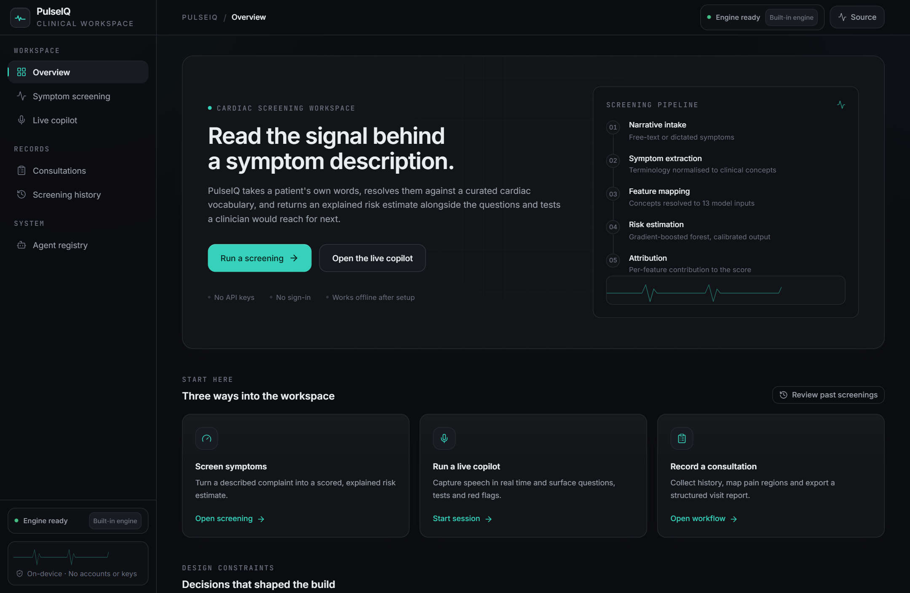
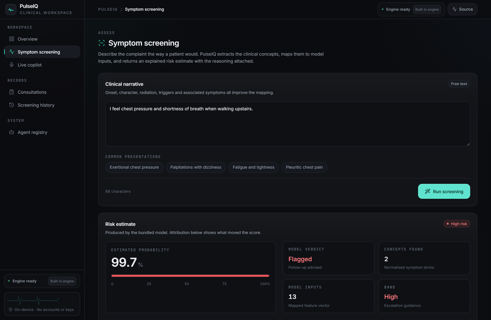
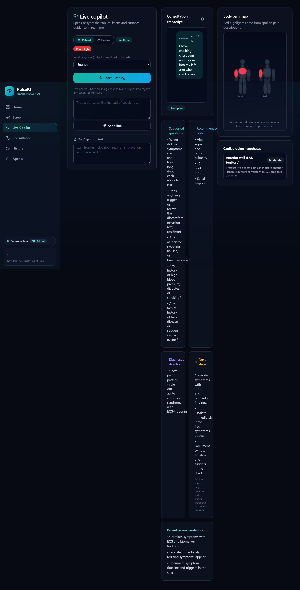
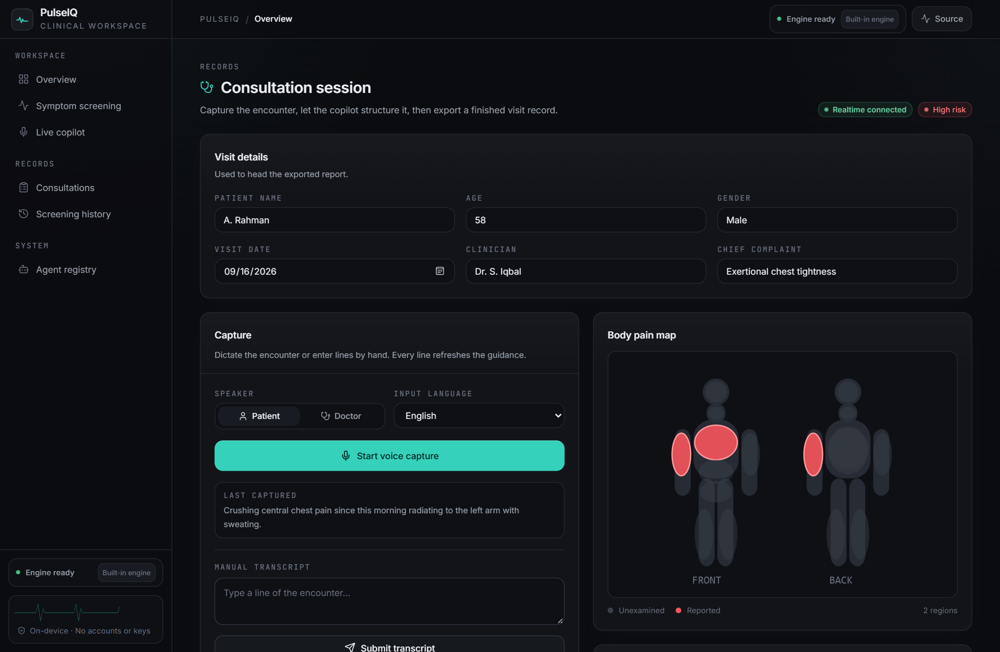
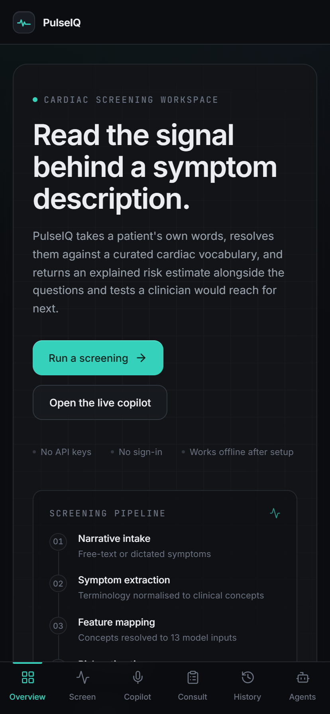

<div align="center">



# 🫀 PulseIQ

### Cardiac screening that explains itself.

**An open-source clinical workspace that turns a patient's own words into an explained
risk estimate — then carries the encounter through to a structured report.**

Runs locally. No accounts. No API keys. No data leaves the device.

[](LICENSE)
[](https://www.python.org/)
[](https://fastapi.tiangolo.com/)
[](https://react.dev/)
[](https://www.typescriptlang.org/)

[**🌐 Live project page**](https://aabyyss.github.io/PulseIQ-/) · [**▶ Watch the walkthrough**](cardio-ai-system/docs/demo/pulseiq-demo.mp4) · [**📸 Screenshots**](cardio-ai-system/docs/screenshots) · [**🤝 Contributing**](#-contributing)

</div>

---

## Why PulseIQ exists

Most medical-AI demos quietly depend on a paid LLM key — the demo works until you try it.
**PulseIQ was built to need nothing.** A built-in clinical language engine does all of the
language work offline. An optional free local model upgrades the experience automatically if
one is running. A hosted model is an option, never a prerequisite.

And instead of returning a bare score, every screen shows its reasoning: which concepts were
detected, which model inputs they produced, and what a clinician would reach for next.

## ✨ What it does

| | Feature | What it does |
|---|---|---|
| 🩺 | **Symptom screening** | Free-text narrative → clinical concepts → 13 model inputs → an explained probability, with every step visible |
| 🎙️ | **Live copilot** | Realtime speech-to-text with speaker attribution, suggested questions, recommended investigations and red-flag escalation |
| 🧍 | **Body pain mapping** | Described pain plots onto a front/back diagram as the encounter runs |
| 📄 | **Consultation reports** | Structured visit capture → one-click PDF export of summary, advice, plan and red flags |
| 🌍 | **Multilingual capture** | Urdu, Hindi, Arabic, French, Spanish, German, Mandarin — normalised to English |
| 🖼️ | **Report reading** | Lab reports and scans parsed for key findings (needs a vision model) |
| 🕘 | **History & review** | Last 20 screenings kept on-device, with band distribution and mean probability |
| 🤖 | **17 clinical agents** | Guidelines, uncertainty, causality, fairness, robustness, explainability — each an isolated, replaceable module |

<div align="center">

| | |
|:---:|:---:|
|  |  |
| *Explained screening result* | *Live consultation copilot* |
|  |  |
| *Consultation capture* | *Narrow viewport* |

</div>

## 🆓 The free-AI model (three tiers, none required)

| Tier | What it provides | Setup |
|---|---|---|
| **1 · Always on** | Built-in rule-based clinical engine — insights, copilot plans, reports, fully offline | **Nothing. It's the default.** |
| **2 · Optional** | [Ollama](https://ollama.com) local LLM — richer AI text, still free & local, auto-detected | `ollama pull llama3.2` |
| **3 · Optional** | Gemini free tier — used automatically if you already have a key | `GEMINI_API_KEY` env var |

## 🚀 Quickstart

**Windows** — or just double-click `Start-PulseIQ.cmd`:

```powershell
Set-ExecutionPolicy -Scope Process -ExecutionPolicy Bypass
.\setup.ps1          # one-time: virtualenv, dependencies, spaCy model
.\run-backend.ps1    # terminal 1
.\run-frontend.ps1   # terminal 2  →  http://localhost:5173
```

<details>
<summary><b>macOS / Linux</b></summary>

```bash
python -m venv .venv && source .venv/bin/activate
pip install -r requirements.txt
python -m spacy download en_core_web_sm

uvicorn backend.api_server:app --port 8000        # terminal 1

cd cardio-ai-system/frontend && npm install && npm run dev    # terminal 2
```
</details>

## 🧠 Model card

Random Forest over the public heart dataset (1,025 rows · 13 features).

> **⚠️ Inverted-target note.** The widely circulated `heart.csv` ships with `target=1` meaning
> *healthy*. PulseIQ flips the label at training time, and the training script asserts that
> textbook disease and healthy profiles score in the expected direction — so this real defect
> in the source data can never silently return.

| Metric | Value |
|---|---|
| Accuracy | 0.971 |
| Precision | 0.943 |
| Recall | 1.000 |
| F1 | 0.971 |
| ROC-AUC | 1.000 |
| 5-fold CV | 0.98 – 1.00 |

## 🏗️ Architecture

```
frontend  React 18 · Vite · TypeScript · Tailwind
  ├── /               overview & pipeline
  ├── /diagnose       POST /diagnose · /ai-insights · /analyze-report-image
  ├── /live           WS   /ws/consultation
  ├── /workflow/*     structured visit → POST /final-report → PDF
  ├── /history        local browser storage
  └── /agents         GET  /research-agents

backend  FastAPI
  ├── api_server.py       routes, CORS, /health
  ├── orchestrator.py     extraction → feature mapping → model → risk band
  ├── ai_assistant.py     three-tier reasoning, none of it required
  └── realtime_service.py per-line fusion across the clinical agents

agents/    17 rule-grounded clinical modules
models/    trained model + metadata
```

## 📁 Repository layout

```
cardio-ai-system/
├── backend/     FastAPI server, training script, pipeline checks
├── agents/      rule-grounded clinical modules
├── frontend/    React application
├── models/      trained model and metadata
├── data/        dataset
├── docs/        screenshots & demo video
├── scripts/     screenshot capture helper
└── setup.ps1 · run-*.ps1 · Start-PulseIQ.cmd
```

## 🤝 Contributing

Issues and pull requests are welcome. Good first areas: more symptom vocabulary, additional
capture languages, and extending the agent registry. Run `npm run typecheck && npm run build`
in `cardio-ai-system/frontend` before submitting.

## ⚠️ Scope

PulseIQ is a **screening and documentation aid**. It does not diagnose, and its output must be
reviewed by a qualified clinician before informing care. Any presentation suggesting acute
coronary syndrome — ongoing chest pain, syncope or respiratory distress — must be escalated on
clinical grounds alone, regardless of what this software reports.

## 📄 License

MIT — see [LICENSE](LICENSE).

<div align="center">
<sub>Built as an open reference implementation of local-first clinical decision support.</sub>
</div>
