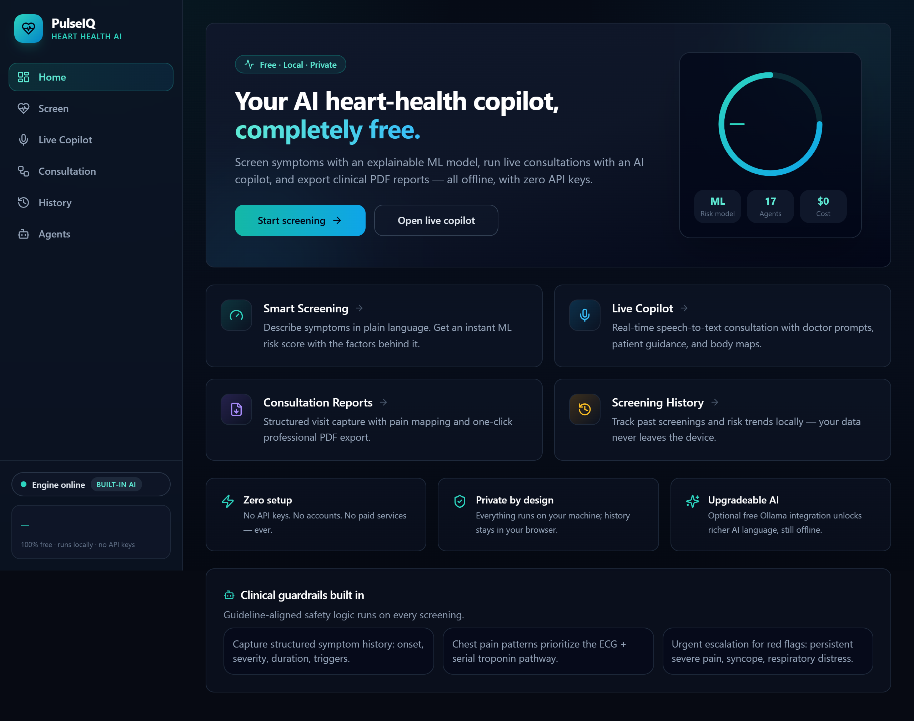
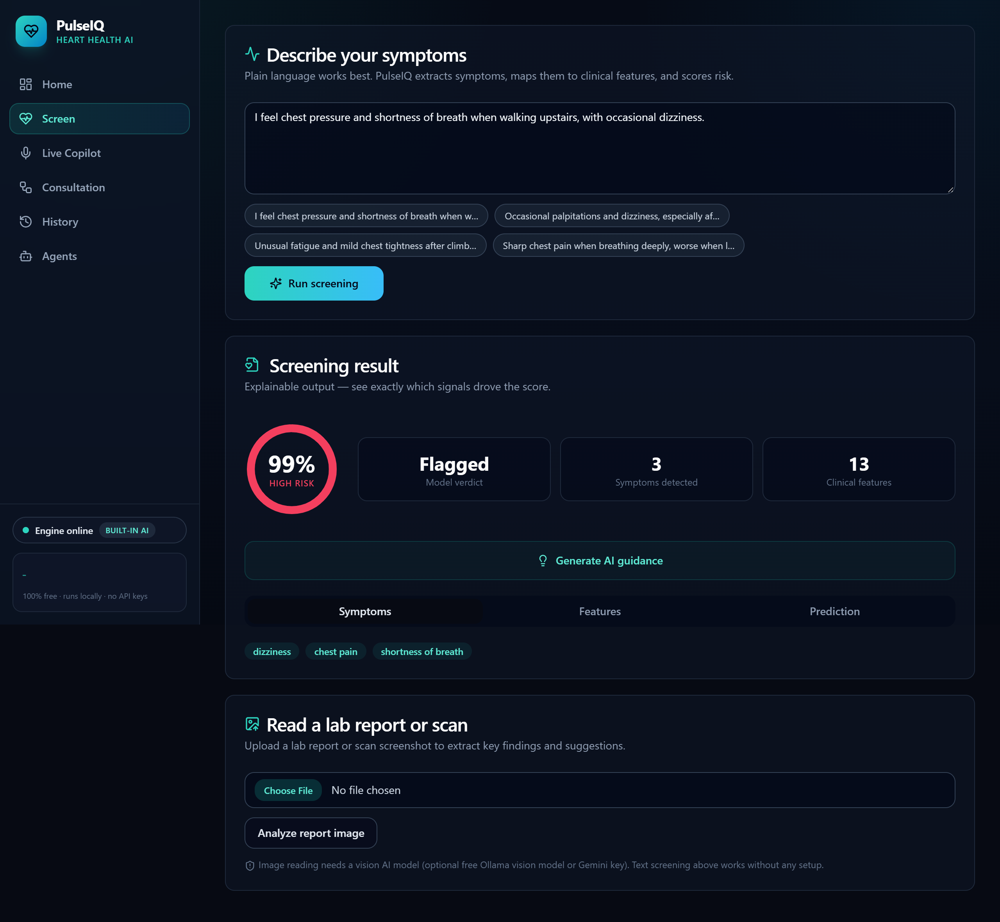
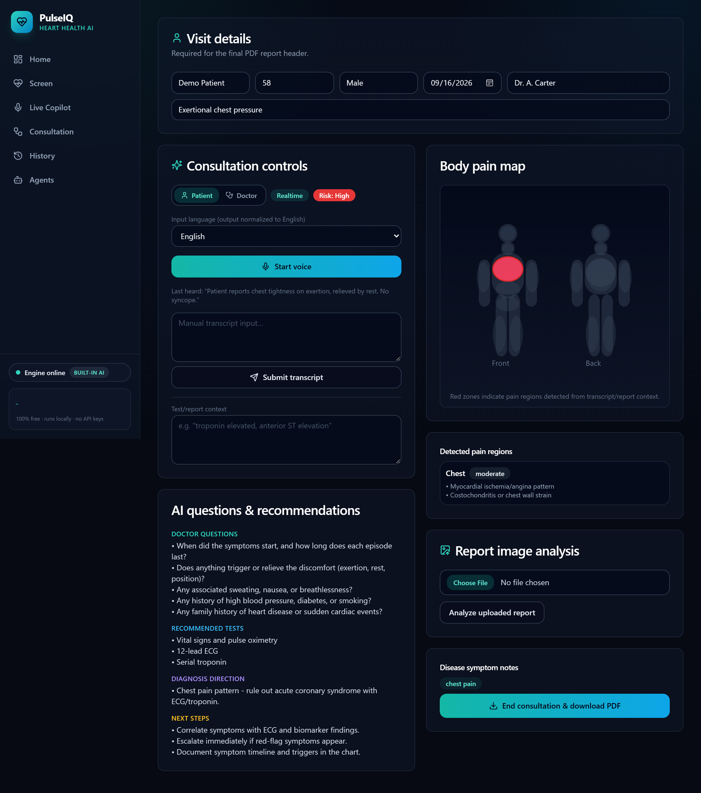
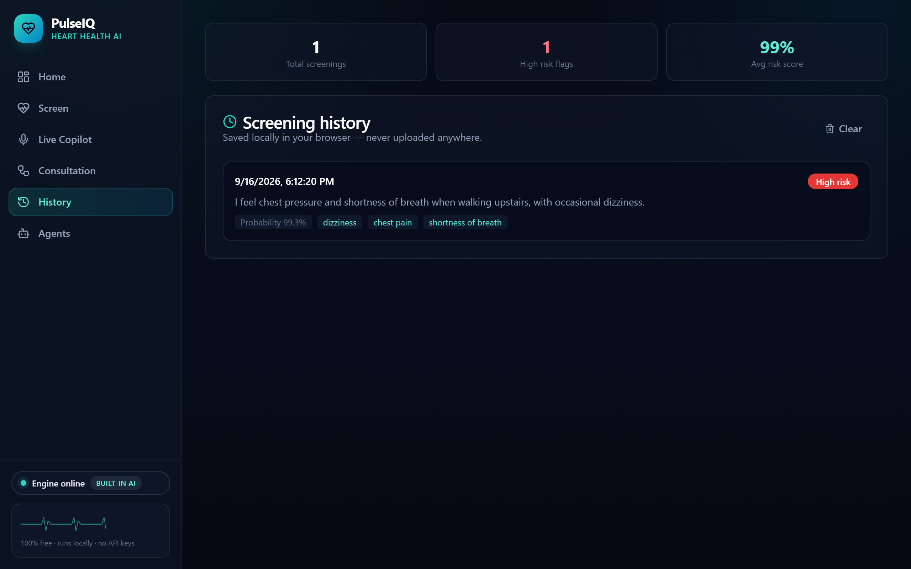

<div align="center">

# 🫀 PulseIQ

**AI Heart Health Intelligence — free, local, and private.**

Symptom screening with an explainable ML model · live consultation copilot · body pain mapping · clinical PDF reports.
**Zero API keys. Zero paid services. Zero configuration.**

[](https://www.python.org/)
[](https://fastapi.tiangolo.com/)
[](https://react.dev/)
[](https://www.typescriptlang.org/)
[](LICENSE)

[Project page](https://aabyyss.github.io/Agentic-Cardio-Assistant/) · [Demo video](docs/demo/pulseiq-demo.mp4) · [Screenshots](docs/screenshots)



</div>

---

## Why PulseIQ

Most medical AI demos quietly require a paid LLM key. **PulseIQ was built to need nothing:**
a built-in clinical language engine does all AI work offline, an optional free local LLM
([Ollama](https://ollama.com)) upgrades the experience automatically, and your data never
leaves the machine.

## ✨ Features

| | Feature | What it does |
|---|---|---|
| 🫀 | **Smart Screening** | Plain-language symptoms → explainable ML risk score with per-feature SHAP contributions |
| 🎙️ | **Live Copilot** | Realtime speech-to-text consultations with doctor prompts, test suggestions, and urgency flags |
| 🧍 | **Body Pain Map** | Interactive front/back body diagram highlights pain regions as the patient speaks |
| 📄 | **Consultation Reports** | Structured visit capture → one-click professional PDF export |
| 🌍 | **Multilingual** | Speak in Urdu, Hindi, Arabic, French, Spanish, German, or Chinese; transcripts normalized to English |
| 🖼️ | **Report Reading** | Upload lab reports/scans for AI-assisted key-finding extraction (needs a vision model) |
| 🕘 | **History & Trends** | Locally stored screening history with risk statistics |
| 🧪 | **17 Research Agents** | Guidelines, uncertainty, causality, fairness, robustness, explainability, and more |

## 🆓 The free AI model (three tiers)

| Tier | What | Setup |
|---|---|---|
| **1 · Always on** | Built-in rule-based clinical engine — insights, copilot plans, reports, fully offline | Nothing. It's the default |
| **2 · Optional** | [Ollama](https://ollama.com) local LLM — richer AI text, still free & local, auto-detected | `ollama pull llama3.2` |
| **3 · Optional** | Gemini free tier — used automatically if you already have a key | Set `GEMINI_API_KEY` env var |

## 🚀 Quickstart

**Windows** (or double-click `Start-PulseIQ.cmd`):

```powershell
# 1. one-time setup
Set-ExecutionPolicy -Scope Process -ExecutionPolicy Bypass
.\setup.ps1

# 2. start backend
.\run-backend.ps1

# 3. start frontend (second terminal)
.\run-frontend.ps1

# 4. open http://localhost:5173
```

<details>
<summary><b>macOS / Linux</b></summary>

```bash
python -m venv .venv && source .venv/bin/activate
pip install -r requirements.txt
python -m spacy download en_core_web_sm
uvicorn backend.api_server:app --port 8000        # terminal 1

cd frontend && npm install && npm run dev         # terminal 2
# open http://localhost:5173
```
</details>

## 🧠 Model card

PulseIQ screens with a Random Forest on the public UCI-style heart dataset (1,025 rows, 13 features).

> **⚠️ Label fix note:** the widely-circulated `heart.csv` ships with an **inverted target
> column** (class 1 = healthy). PulseIQ detects and flips this during training — the
> training script asserts textbook disease/healthy profiles score correctly, so this
> regression can never silently return. See `backend/train_model.py`.

| Metric | Value |
|---|---|
| Accuracy | 0.971 |
| Precision | 0.943 |
| Recall | 1.000 |
| ROC-AUC | 1.000 |
| 5-fold CV | 0.98 – 1.00 |

*Screening output is decision support, not diagnosis.*

## 🏗️ Architecture

```
frontend (React 18 + Vite + TS + Tailwind)
  ├── /diagnose   → POST /diagnose, /ai-insights
  ├── /live       → WS /ws/consultation (realtime copilot)
  ├── /workflow   → structured visit → POST /final-report → PDF
  └── /history    → local browser storage

backend (FastAPI)
  ├── orchestrator.py        symptom extraction → features → model → risk band
  ├── ai_assistant.py        3-tier free AI (local engine / Ollama / Gemini)
  ├── realtime_service.py    17 clinical agents fused per transcript line
  └── agents/                guidelines, uncertainty, causal, fairness, SHAP…
models/heart_model.pkl        retrained RandomForest (label-flip fixed)
```

## 📁 Repository layout

```
cardio-ai-system/
├── backend/          FastAPI server + pipeline scripts
├── agents/           17 rule-based clinical AI agents
├── frontend/         React app (this is the UI)
├── models/           trained model + metadata
├── data/             heart.csv dataset
├── docs/             GitHub Pages site, screenshots, demo video
├── scripts/          screenshot capture helper
├── notebooks/        analysis notebooks
└── setup.ps1 / run-*.ps1 / Start-PulseIQ.cmd
```

## 🖼️ Screenshots

| Screen | |
|---|---|
|  |  |
|  |  |

## ⚠️ Disclaimer

PulseIQ is an **educational decision-support tool**. It does not diagnose disease and does
not replace professional medical care. Always consult a qualified clinician. In an
emergency, call your local emergency number.

## 📄 License

MIT — see [LICENSE](LICENSE).
