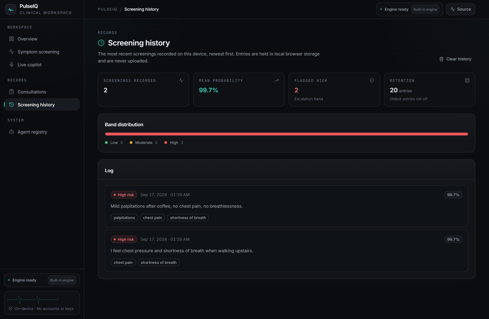

<div align="center">

# PulseIQ

**Cardiac screening and consultation workspace.** Symptom narrative in, explained risk estimate out,
with live encounter capture, regional pain mapping and structured report export.

Runs locally. No accounts, no API keys, no paid services.

[](LICENSE)
[](https://www.python.org/)
[](https://react.dev/)
[](https://www.typescriptlang.org/)

[Project page](https://aabyyss.github.io/PulseIQ-/) · [Walkthrough](docs/demo/pulseiq-demo.mp4) · [Screenshots](docs/screenshots)


</div>

---

## What it is

Most clinical AI demos quietly depend on a hosted model key. PulseIQ is built to need nothing: a
built-in rule engine performs the language work offline, a local model can be used if one happens to
be running, and a hosted model is optional rather than a prerequisite.

The workspace covers one pathway end to end — screening, live capture, mapping, review and export —
and shows its reasoning at every step rather than returning a bare score.

## Capabilities

| Feature | What it does |
|---|---|
| **Symptom screening** | Free-text narrative is normalised to clinical concepts, resolved to 13 model inputs, and scored with an explanation of what moved the result |
| **Live copilot** | Realtime speech-to-text with speaker attribution, suggested questions, recommended investigations and escalation notes |
| **Body pain mapping** | Reported pain locations plot onto a front and back diagram as the encounter runs |
| **Consultation reports** | Structured visit capture with one-click PDF export of summary, advice, plan and red flags |
| **Multilingual capture** | Urdu, Hindi, Arabic, French, Spanish, German and Chinese input, normalised to English |
| **Report reading** | Lab report and scan images are parsed for key findings (requires a vision model) |
| **Screening history** | The last 20 screenings, held locally, with band distribution and mean probability |
| **Agent registry** | Each capability is an isolated, rule-grounded module with a stated responsibility |

## Reasoning tiers

| Tier | What it provides | Setup |
|---|---|---|
| **1 · Always on** | Built-in clinical language engine — insights, copilot plans, reports, fully offline | None. This is the default |
| **2 · Optional** | A local LLM through [Ollama](https://ollama.com), auto-detected when running | `ollama pull llama3.2` |
| **3 · Optional** | A hosted model, used automatically if a key is already present | `GEMINI_API_KEY` environment variable |

## Quickstart

**Windows** — or double-click `Start-PulseIQ.cmd`:

```powershell
Set-ExecutionPolicy -Scope Process -ExecutionPolicy Bypass
.\setup.ps1          # one-time: virtualenv, dependencies, spacy model
.\run-backend.ps1    # terminal 1
.\run-frontend.ps1   # terminal 2  →  http://localhost:5173
```

<details>
<summary><b>macOS / Linux</b></summary>

```bash
python -m venv .venv && source .venv/bin/activate
pip install -r requirements.txt
python -m spacy download en_core_web_sm

uvicorn backend.api_server:app --port 8000        # terminal 1

cd frontend && npm install && npm run dev         # terminal 2
```
</details>

## Model card

A Random Forest over the public heart dataset (1,025 rows, 13 features).

> **Inverted target note.** The widely circulated `heart.csv` ships with `target=1` meaning
> *healthy*. PulseIQ flips the label at training time, and `backend/train_model.py` asserts that
> textbook disease and healthy profiles score in the expected direction. This inversion is a real
> defect in the source data, not a description of the pipeline — the assertion prevents it from
> returning silently.

| Metric | Value |
|---|---|
| Accuracy | 0.971 |
| Precision | 0.943 |
| Recall | 1.000 |
| F1 | 0.971 |
| ROC-AUC | 1.000 |
| 5-fold CV accuracy | 0.98 – 1.00 |
| Sanity profiles | disease-like 0.84 · healthy-like 0.09 |

Screening output is decision support, not diagnosis.

## Architecture

```
frontend  React 18 · Vite · TypeScript · Tailwind
  ├── /               overview and pipeline
  ├── /diagnose       POST /diagnose, /ai-insights, /analyze-report-image
  ├── /live           WS  /ws/consultation
  ├── /workflow/*     structured visit → POST /final-report → PDF
  ├── /history        local browser storage
  └── /agents         GET /research-agents

backend  FastAPI
  ├── api_server.py       routes, CORS, /health
  ├── orchestrator.py     extraction → feature mapping → model → band
  ├── ai_assistant.py     three-tier reasoning, none of it required
  ├── realtime_service.py per-line fusion across the clinical agents
  └── …
agents/                   rule-grounded clinical modules
models/                   trained model + metadata
data/                     heart.csv
docs/                     screenshots and walkthrough media
scripts/                  screenshot capture helper
```

## Repository layout

```
cardio-ai-system/
├── backend/     FastAPI server, training script, pipeline checks
├── agents/      rule-grounded clinical modules
├── frontend/    React application
├── models/      trained model and metadata
├── data/        dataset
├── docs/        screenshots and demo media
├── scripts/     capture-screenshots.cjs
└── setup.ps1, run-*.ps1, Start-PulseIQ.cmd
```

## Screens

| | |
|---|---|
|  |  |
|  |  |

## Scope

PulseIQ is a screening and documentation aid. It does not diagnose, and its output must be reviewed
by a qualified clinician before informing care. Any presentation suggesting acute coronary syndrome —
ongoing chest pain, syncope or respiratory distress — must be escalated on clinical grounds alone,
irrespective of what this software reports.

## License

MIT — see [LICENSE](LICENSE).
